# Desktop UI Kit — Atomic Design Hierarchy

```mermaid
graph TD
    classDef atom fill:#E3F2FD,stroke:#1976D2,color:#0D47A1;
    classDef molecule fill:#E8F5E9,stroke:#388E3C,color:#1B5E20;
    classDef organism fill:#FFF3E0,stroke:#F57C00,color:#E65100;
    classDef pattern fill:#F3E5F5,stroke:#8E24AA,color:#4A148C;
    classDef missing fill:#FAFAFA,stroke:#BDBDBD,color:#9E9E9E,stroke-dasharray: 5 5;

    %% ===== ATOMS =====
    subgraph ATOMS["⚛️ ATOMS — primitives, no component deps"]
        Button["Button"]:::atom
        Avatar["Avatar"]:::atom
        Badge["Badge"]:::atom
        Checkbox["Checkbox"]:::atom
        Chip["Chip"]:::atom
        Label["Label / StatusLabel"]:::atom
        Loader["Loader"]:::atom
        ProgressBar["ProgressBar"]:::atom
        RadioButton["RadioButton"]:::atom
        Skeleton["Skeleton"]:::atom
        TextField["TextField"]:::atom
        TextArea["TextArea"]:::atom
        Toggle["Toggle"]:::atom
        Breadcrumb["Breadcrumb*"]:::atom
    end

    %% ===== MOLECULES =====
    subgraph MOLECULES["🧬 MOLECULES — compose 1–2 atoms"]
        Accordion["Accordion"]:::molecule
        DatePicker["DatePicker"]:::molecule
        Dropdown["Dropdown"]:::molecule
        FileUpload["FileUpload"]:::molecule
        Tooltip["Tooltip"]:::molecule
        Toast["Toast"]:::molecule
        Coachmark["Coachmark"]:::molecule
        Tabs["Tabs"]:::molecule
        Search["Search"]:::molecule
        Select["Select"]:::molecule
        Pagination["Pagination"]:::molecule
        Banner["Banner"]:::molecule
        ProgressIndicator["ProgressIndicator"]:::molecule
    end

    %% ===== ORGANISMS =====
    subgraph ORGANISMS["🦠 ORGANISMS — multi-atom composites"]
        Table["Table"]:::organism
        Dialog["Dialog"]:::organism
        Carousel["Carousel"]:::organism
    end

    %% ===== PATTERNS =====
    subgraph PATTERNS["🧩 PATTERNS pkg — domain organisms"]
        PageHeader["page-header"]:::pattern
        FilterToolbar["filter-toolbar"]:::pattern
        FormSection["form-section"]:::pattern
        DetailPanel["detail-panel"]:::pattern
        EmptyListState["empty-list-state"]:::pattern
    end

    %% ===== TEMPLATES (missing) =====
    subgraph TEMPLATES["📄 TEMPLATES — not yet implemented"]
        ListTpl["ListPageTemplate (proposed)"]:::missing
        DetailTpl["DetailPageTemplate (proposed)"]:::missing
    end

    %% ---- composition edges (A --> B means A is built from B) ----
    Accordion --> Button
    DatePicker --> Button
    Dropdown --> Button
    FileUpload --> Button
    Tooltip --> Button
    Toast --> Button
    Coachmark --> Button
    ProgressIndicator --> Button
    Tabs --> Badge
    Search --> Button
    Search --> Skeleton

    Table --> Checkbox
    Table --> Label
    Dialog --> Button

    PageHeader --> Breadcrumb
    PageHeader --> Button
    PageHeader --> Label
    FilterToolbar --> Button
    FilterToolbar --> Search
    FormSection --> Button
    FormSection --> TextField
    DetailPanel --> Label
    EmptyListState --> Button

    ListTpl -.-> PageHeader
    ListTpl -.-> FilterToolbar
    ListTpl -.-> Table
    ListTpl -.-> Pagination
    ListTpl -.-> EmptyListState
    DetailTpl -.-> PageHeader
    DetailTpl -.-> DetailPanel
    DetailTpl -.-> FormSection
```

\* `Breadcrumb` has no component dependencies (structurally an atom) but is conceptually a navigation molecule.

**Legend:** solid arrows = actual composition in code · dashed arrows = proposed template composition (not yet built).
